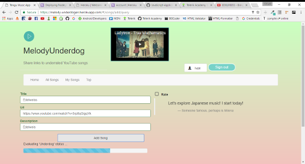

##  Description:

YT Music Video Share App:

#### [https://melody-underdogen.herokuapp.com/#/](https://melody-underdogen.herokuapp.com/#/)

#### [Demo](https://www.youtube.com/watch?v=Li8yHSaWTCY&t=31s)

* Users can be registered and signed in the application
  * Users provide username and password
  * On login/register they receive an authorization key
    * It is used for all other operations

* Signed in users can:
  * Add a YouTube link to a song video:
    * Song items have title, description and valid link
  * Comment under an item
  * Give stars to an item

Users can add a song. Only five stars to give per day. Only older songs with low
views and rating can be added (data queried from YT's data API).
The lower the views/likes, the higher the starting stars/underdog modifier. Comments are anonymous, one random comment is displayed
under the "watch video" box (carousel).

## Routes
 #### Node Server

Users and registration related, plus:

* `#/` - Home page
* `#/songs` - Get songs by current user
* `#/songs/all` - Get all songs
* `#/songs/add` - Post new song item (title, description, link)
* `#/songs/id` - Get a specific song item
* `#/songs/id` - Delete song (POST)
* `#/songs/id/rate` - Post stars/rate
* `#/songs/id/comments` - Get comments for song
* `#/songs/id/comment` - Post new comment
* `#/songs/top/:count` - Top number of songs with most stars

#### Exernal Endpoints

* YouTube data API